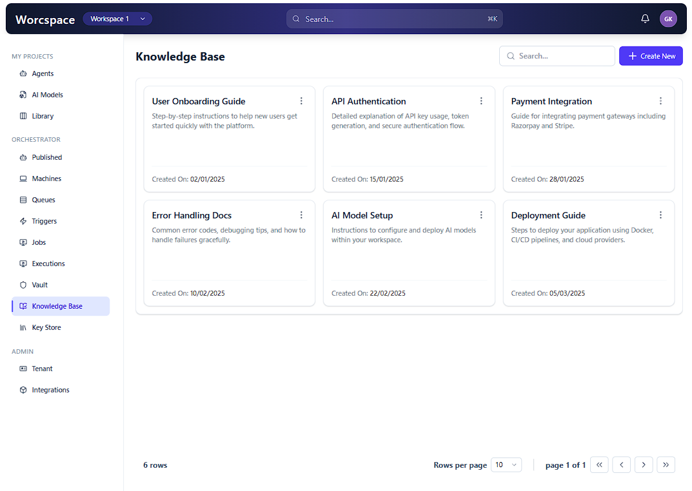
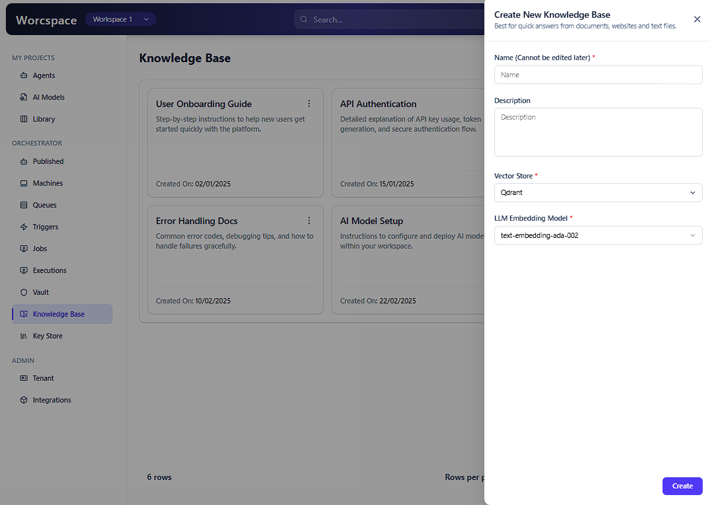

# Knowledge Base Dashboard

A responsive React application that replicates a Figma design for a Knowledge Base management system. This project demonstrates component-based architecture, state management, and Tailwind CSS styling.

## 📋 Assignment Overview

This project is a React UI assignment that evaluates:

- **Design Translation**: Converting Figma designs to pixel-accurate UI
- **Component Architecture**: Building scalable, reusable components
- **State Management**: Handling user interactions and modal states
- **Code Quality**: Clean, maintainable, well-organized code

## 🎨 Screens Implemented

### Screen 1: Home Screen

The main Knowledge Base interface displaying a list of knowledge cards with a sidebar navigation.



**Features:**

- Header with logo and navigation
- Sidebar with menu items
- Grid of Knowledge Cards
- Responsive layout

### Screen 2: Create New Modal

Pop-up dialog that appears when the user clicks the 'Create New' button.



**Features:**

- Modal overlay
- Form fields for creating new knowledge base items
- Close button functionality
- Smooth animations

## 🛠️ Tech Stack

- **Framework**: React 18+ with Functional Components & Hooks
- **Styling**: Tailwind CSS
- **Build Tool**: Vite
- **Linting**: ESLint
- **Package Manager**: npm

## 📁 Project Structure

```
src/
├── components/
│   ├── layouts/
│   │   ├── Header.jsx          # Top navigation header
│   │   └── Sidebar.jsx          # Left sidebar navigation
│   ├── knowledge/
│   │   ├── KnowledgeCard.jsx   # Individual knowledge card component
│   │   ├── KnowledgeHeader.jsx # Header section of knowledge cards
│   │   ├── KnowledgeFooter.jsx # Footer section of knowledge cards
│   │   └── KnowledgeModal.jsx  # Create New modal component
│   └── ...
├── pages/
│   └── Home.jsx                # Main home page
├── App.jsx                      # Root component
├── index.css                    # Global styles
└── main.jsx                     # React entry point
```

## 🎯 Key Features

✅ **Responsive Design** - Mobile, tablet, and desktop layouts
✅ **Component Reusability** - Modular component structure
✅ **State Management** - Modal open/close state handling
✅ **Interactive Elements** - Create New button triggers modal
✅ **Color Scheme** - Primary: #4F46E5 | Secondary: #1E1B4B
✅ **Typography & Spacing** - Consistent with Figma design

## 🚀 Installation & Setup

### Prerequisites

- Node.js (v14 or higher)
- npm or yarn

### Installation Steps

1. **Clone the repository**

   ```bash
   git clone https://github.com/Known-user/dashboard.git
   cd dashboard
   ```

2. **Install dependencies**

   ```bash
   npm install
   ```

3. **Install Tailwind CSS (if not already configured)**
   ```bash
   npm install -D tailwindcss postcss autoprefixer
   npx tailwindcss init -p
   ```

## 💻 Running the Application

### Development Mode

```bash
npm run dev
```

The application will start on `http://localhost:5173` (or another available port)

### Build for Production

```bash
npm run build
```

### Preview Production Build

```bash
npm run preview
```

## 📄 License

This project is part of a React UI assignment.

---

**Last Updated**: March 30, 2026
